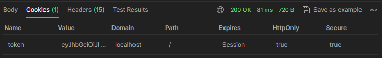
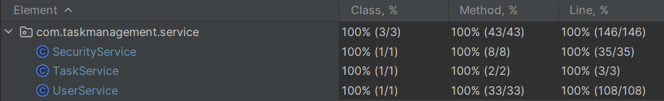

[](https://sonarcloud.io/summary/new_code?id=k9targex_Task-Management-System-for-Effective-Mobile)
[](https://sonarcloud.io/summary/new_code?id=k9targex_Task-Management-System-for-Effective-Mobile)
[](https://sonarcloud.io/summary/new_code?id=k9targex_Task-Management-System-for-Effective-Mobile)


# Task Management System

## Overview

This Task Management System is a Java-based application built with Spring Boot, designed to manage tasks, users, and their roles. It allows users to create, edit, delete, and view tasks. Each task has a title, description, status (e.g., "pending", "in progress", "completed"), and priority (e.g., "high", "medium", "low"). The system also supports user authentication and authorization via JWT tokens.

## Features

- **User Authentication and Authorization**: Users can register, sign in, and manage their tasks securely using JWT tokens.
- **Task Management**: Users can create, edit, delete, and view their tasks. They can also assign tasks to other users and manage task statuses.
- **Commenting**: Users can add comments to their tasks.
- **Filtering and Pagination**: Tasks can be filtered by user id, status, and priority, with support for pagination.
- **OpenAPI and Swagger Documentation**: The API is documented using OpenAPI and is accessible via Swagger UI.

## JWT Authentication and Cookie Management

The Task Management System uses JWT (JSON Web Tokens) for authenticating users. Here's how the JWT is managed during registration and login:

### JWT in Cookies


- **JWT Storage**: After a user successfully registers or logs into the system, a JWT is generated and sent back to the client. Instead of storing this token in local storage or sending it directly with each request, the JWT is stored in an HTTP-only, Secure cookie.
  
- **HttpOnly Flag**: The `HttpOnly` flag is set on the cookie, which prevents client-side scripts from accessing the token. This enhances security by mitigating the risk of XSS (Cross-Site Scripting) attacks, as the token cannot be accessed or manipulated through JavaScript.

- **Secure Flag**: The `Secure` flag is also set on the cookie, ensuring that the token is only sent over HTTPS connections. This provides an additional layer of protection, as the token won't be transmitted over unencrypted connections.
        

### Benefits

- **Enhanced Security**: Storing the JWT in an HTTP-only, Secure cookie minimizes the attack surface by ensuring that the token is handled securely, only accessible to the server, and transmitted over secure channels.
- **Simplified Requests**: By automatically including the JWT in the cookie, you don't need to manually attach the token to each API request. The browser will automatically send the cookie with each request to the server, simplifying the authentication process.


## Custom Error Handling and Logging

### Custom Error Handling

The application includes a custom error handler to manage and respond to exceptions consistently. The custom error handler catches various types of exceptions and returns appropriate HTTP responses.

### Logging with Aspects

Logging is implemented using Spring AOP to capture and record method execution details across the application. This approach ensures that logging concerns are separated from the core business logic.

## Technologies Used

- **Java 17+**
- **Spring Boot**
- **Spring Security**
- **PostgreSQL**
- **JWT for Authentication**
- **Swagger/OpenAPI for API Documentation**

## Endpoints
lable endpoints, including request and response formats, please refer to the Swagger documentation available at 
` http://localhost:8080/swagger-ui/index.html#/` 
after running application. The Swagger interface provides a comprehensive overview of the API, including:

### Authentication

- **`POST /auth/signup`** - Register a new user.
- **`POST /auth/signin`** - Sign in an existing user.

### Task Management 


#### For Authors
- **`POST /users/tasks`** - Create a new task for the authors.
- **`POST /users/tasks/{taskId}/performers/{performerId}`** - Add performer for the task.
- **`PATCH /users/tasks/edit/{taskId}`** - Update details of an existing task (You can update all task and just some fields).
- **`DELETE /users/tasks/{taskId}`** - Delete an existing task by its ID.
  

#### For Performers
- **`PATCH /users/tasks/status/{taskId}`** - Update the status of a specific task.

#### For Authors and Performers
- **`GET /users`** - Retrieve all authors.
- **`GET /tasks`** - Retrieve a list of all tasks.
- **`GET /users/tasks`** - Retrieve tasks for the authenticated user.
- **`GET /users/tasks/user/{userId}?page={page}&size={size}&priority={LOW,MEDIUM,HIGH}&status={PENDING,IN_PROGRESS,COMPLETED}`** - Retrieve tasks for a specific user with optional filters.
- **`GET /users/tasks/comments/{taskId}`** - Retrieve comments for the task.
- **`POST /users/tasks/comments/{taskId}`** - Add comment for your task.

### Comments

- **`POST /users/tasks/comments/{taskId}`** - Add a comment to a specific task.
- **`GET /users/tasks/comments/{taskId}`** - Retrieve all comments for a specific task.


## Swagger and OpenAPI Documentation

The Task Management System's API is fully documented using the OpenAPI specification, which allows for easy integration, testing, and usage of the API.

### Swagger UI

Swagger UI is integrated into the application, providing a user-friendly interface to explore and test the API endpoints. You can access it directly in your browser.

 **Access Swagger UI**:
1. Start the application.
2. Open your web browser and navigate to
```sh
 http://localhost:8080/swagger-ui/index.html#/
 ```


## Unit Tests

### Overview
The project includes unit tests to ensure the reliability and correctness of the core functionalities. These tests are written using JUnit and Mockito frameworks, and they aim to cover the critical aspects of the application, such as service methods, authentication logic, and validation.

### Running the Tests
To run the unit tests, you can use the following command in the root directory of the project:

```bash
 mvnw test
```
This command will execute all unit tests and provide a summary of the results.

### Test Coverage
The unit tests achieve 100% coverage of the business logic, including:

- UserService: Validates operations such as user registration, login, task assignment, and task retrieval.
- TaskService: Ensures correct functionality for creating, updating, retrieving, and deleting tasks.
- SecurityService: Tests JWT token generation, validation, and authentication processes.




## Postman
A Postman collection is provided to facilitate testing the API endpoints. Follow these steps to use it:

1. Import the Postman collection:
- Open Postman.
- Click on the Import button.
- Select the provided Postman collection file `TaskManagement.postman_collection.json`
2. Use the imported collection to send requests to your running application. The collection includes predefined requests for all major functionalities of the application.

    This setup allows you to quickly test and interact with the API, ensuring that all endpoints work as expected.


## Setup Instructions

### Prerequisites

- Java 17+
- Maven 3.9.6 and higher
- PostgreSQL

## Building and Running the Application 

1. Clone the repository:
   ```bash
   git clone https://github.com/your-repo/task-management-system.git
   cd task-management-system

2. Set password and username for postgreSQL in file ```.env``` :
   ```bash
   POSTGRES_DB=TaskManagement_db
   POSTGRES_USER={your_username}
   POSTGRES_PASSWORD={your_password}
   ```
3. Switch postgresql path in ```application.properties```:
 
   - for docker container
   ```
   spring.datasource.url = jdbc:postgresql://postgresql:5432/TaskManagement_db
   ```
   - for running manual
   ```
   #spring.datasource.url=jdbc:postgresql://localhost:5432/TaskManagement
   ```
   


### Run in container
   1. Build application:
      ```
      mvn clean package -DskipTests
      ```
   3.  Build and start the Docker containers:

       ```
       docker-compose up --build
       ```
### Run manually
1. Create the PostgreSQL database TaskManagement.
2. Build application:
   ```bash
   mvn clean package -DskipTests
   ```
3. Run application
   ```bash
   java -jar target/TaskManagement-0.0.1-SNAPSHOT.jar
   ```
## License
  This project is licensed under the MIT License. See the LICENSE file for more information.
## Author
This application was developed by Mozheiko Dmitry.
